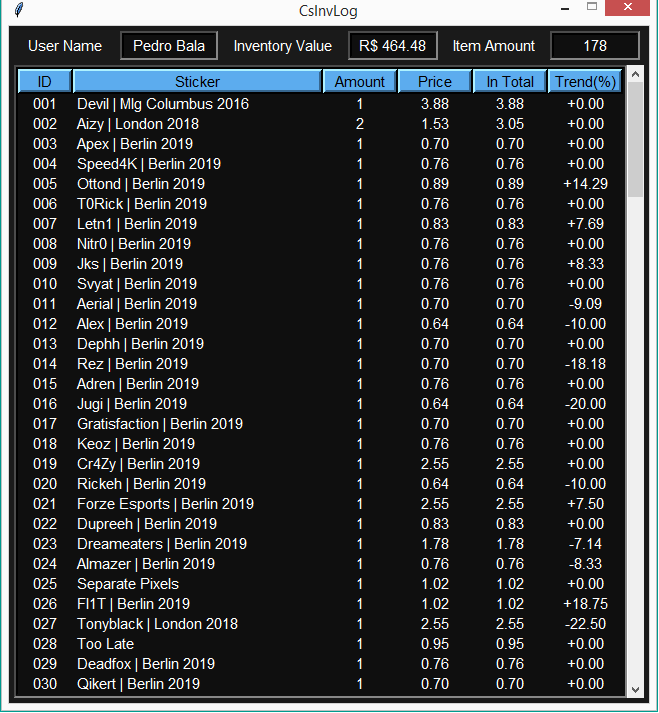

# CSGOInv App Project
  Desktop App for viewing and storing Steam Counter-Strike: Global Offensive inventory prices.
  
  Inventory items and their prices are obtained through csgobackpack.net. The page's html is obtained using the <strong>requests</strong> module. Then a dataframe of the items and prices table is generated using the pandas module.
  
  

  
  

